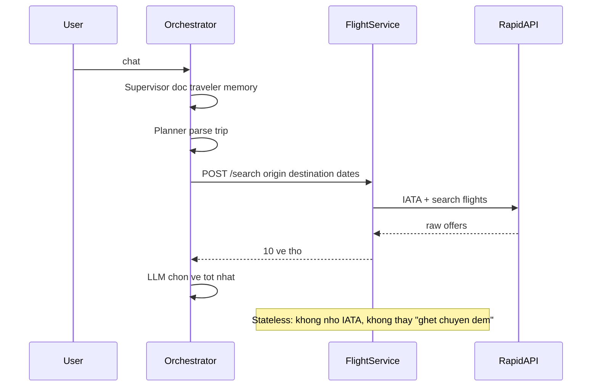
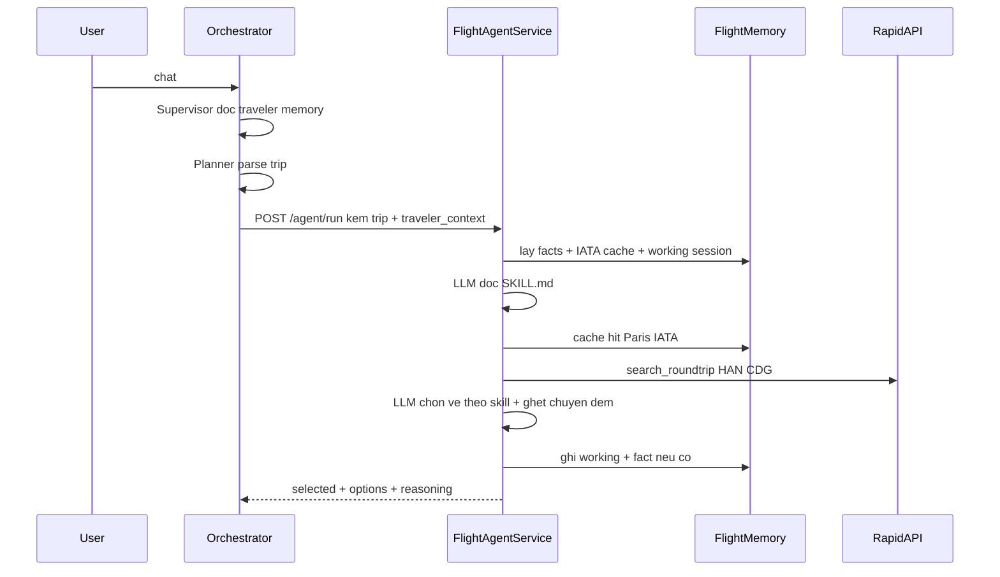

# Skill, tool và memory riêng cho từng agent-service

## Mục tiêu

Hôm nay **não** (LLM chọn vé / khách sạn / sự kiện) nằm ở orchestrator. Năm service chỉ là **tay**: nhận HTTP, gọi Booking.com / Ticketmaster / Tavily / Nominatim, trả JSON thô.

Sau thay đổi, mỗi service **tự nghĩ + tự làm + tự nhớ** việc của mình. Orchestrator chỉ nói: “Tìm vé Hà Nội → Paris, ngân sách 2000€, người này ghét chuyến đêm” — rồi nhận về vé đã chọn.

LangGraph **không đổi thứ tự node**. Planner, Evaluator, Scheduler, Map, Report **không** tách thành service trong phase này.

---

## Đã xong / còn lại

| Phần | Trạng thái | Chỗ trong code |
| --- | --- | --- |
| Runtime chung | Xong | [server/packages/agent_runtime/](server/packages/agent_runtime/) |
| 3 bảng domain memory | Xong | [server/db/models.py](server/db/models.py) + [packages/agent_runtime/models.py](server/packages/agent_runtime/models.py) |
| Docker / env / OpenShift | Xong | Compose + CI context `./server`; image copy `packages/`; OpenShift 512Mi + `DATABASE_URL` |
| Flight `/agent/run` | Xong | [flight-service](server/services/flight-service/) `SKILL.md` + tools + `/agent/run` |
| Hotel / Event / Activity / Geo | Xong | Cùng khung skill/tools/`/agent/run`; geo cache-first Nominatim |
| Node orchestrator mỏng | Xong | [nodes.py](server/nodes.py) 5 node POST `/agent/run`; fallback `/search` nếu lỗi |

Không viết lại runtime. Việc còn lại là **cắm** package vào 5 service và **rút** LLM ra khỏi 5 node.

---

## Ba khái niệm (ví dụ Flight)

Tưởng tượng Flight Agent như nhân viên phòng vé.

**Skill** = sổ tay nội bộ, file markdown, không phải code. Runtime đọc `skills/*.md` → system prompt. Đổi cách chọn vé = sửa markdown.

**Tool** = việc nhân viên được phép làm (hàm Python bọc API sẵn có). LLM **trong chính flight-service** quyết định gọi tool nào. Orchestrator không hardcode “gọi `/search` rồi LLM chọn”.

**Memory** = sổ tay riêng của phòng vé. Không phải hồ sơ khách toàn công ty.

Ví dụ user An:

- Orchestrator nhớ: An ở Hà Nội, budget trung bình, ăn chay — **traveler memory, đã có**
- Flight nhớ: An ghét layover, IATA Paris = CDG+ORY — **domain memory, chưa gắn vào service**
- Hotel nhớ: An thích boutique, rating ≥ 8.0
- Flight **không** nhớ khách sạn; Hotel **không** nhớ IATA

---

## Hai lớp memory — không gộp một bảng

### A. Traveler memory — giữ nguyên ở orchestrator

[server/memory/](server/memory/manager.py): working (chat, slots), semantic (home city, budget, dietary), episodic (trip trước).

Supervisor / Planner đọc lớp này. **Không** copy vào Flight DB. Node chỉ gửi một đoạn text `traveler_context` (từ `TripState.memory_context` + feedback) để agent-service tự dùng.

### B. Domain memory — mỗi service một `DomainMemory(agent_id=...)`

Cùng Postgres `travel_agent`, luôn lọc theo `agent_id` (`flight` | `hotel` | `event` | `activity` | `geocoding`). API đã có ở [memory.py](server/packages/agent_runtime/memory.py):

| Bảng | Gắn với | Ví dụ ghi | Không ghi |
| --- | --- | --- | --- |
| `agent_facts` | `user_id` + `agent_id` | “prefers direct flights” | “chuyến TK1857 ngày 10/6” |
| `agent_working` | `session_id` + `agent_id` | list vé vừa search, vé đang chọn | preference bền |
| `agent_cache` | `cache_key` + `agent_id`, **không** gắn user | `"paris"` → `["CDG","ORY"]` | preference của An |

Retrieve facts: cosine trên embedding (Gemini `text-embedding-004`, 768 chiều), limit 5. Không có embedding thì lấy mới nhất.

`run_agent` đã: retrieve facts + working → tool loop → `submit_result` / `remember_fact` → ghi working + facts. Service chỉ việc đưa `agent_id`, thư mục skill, và tool domain.

Hai bản model (orchestrator `db.models` và `agent_runtime.models`) **phải cùng cột**. `init_db` fail-fast nếu lệch — đừng sửa một bên.

---

## Hôm nay vs sau này

User: “Lên lịch Hà Nội → Paris 10–17/6, 2 người, 2000€, đừng chọn chuyến đêm.”

### Hôm nay



Vấn đề:

- Prompt “ghét chuyến đêm” chỉ sống ở orchestrator; Flight không thấy
- Lần sau Paris vẫn gọi lại IATA API
- Chọn vé nằm trong `flight_agent` ([nodes.py](server/nodes.py)): HTTP rồi `bind_tools(FlightSelection)`

### Sau này



Node `flight_agent` chỉ đóng gói request và ghi `selected_flight` / `flight_options` vào `TripState`.

---

## Runtime đã có — service chỉ cắm vào

Import: `from packages.agent_runtime import ...` khi `PYTHONPATH` trỏ tới `server/`.

| Module | Việc |
| --- | --- |
| [contract.py](server/packages/agent_runtime/contract.py) | `AgentRunRequest` / `AgentRunResponse` / `TripPayload` |
| [skills.py](server/packages/agent_runtime/skills.py) | Đọc `skills/*.md` (frontmatter `name` + `description`) |
| [memory.py](server/packages/agent_runtime/memory.py) | `DomainMemory`: facts / working / cache |
| [runner.py](server/packages/agent_runtime/runner.py) | `run_agent(...)`: prompt + loop + persist |
| [loop.py](server/packages/agent_runtime/loop.py) | `bind_tools`, tối đa **4** bước, dừng khi `submit_result` |
| [llm.py](server/packages/agent_runtime/llm.py) | Groq nếu có `GROQ_API_KEY`, không thì OpenAI |
| [embed.py](server/packages/agent_runtime/embed.py) | Gemini embedding, cùng kiểu [server/memory/embed.py](server/memory/embed.py) |
| [db.py](server/packages/agent_runtime/db.py) | `session_scope`, `init_agent_db`, `agent_service_lifespan` |

Tool loop **không** phải “một HTTP = một API”. LLM có thể:

1. `lookup_iata("Hanoi")`
2. `lookup_iata("Paris")` — cache hit, không ra RapidAPI
3. `search_roundtrip(...)`
4. `submit_result` → `{options, selected, reasoning}`

`task=refine` hoặc working/existing_options còn list → skill bảo **không** search lại.

Contract HTTP chung (mọi service):

- `POST /agent/run` — não
- `GET /agent/skills` — debug skill đã load
- Endpoint cũ (`/search`, `/search_events`, `/geocode`, …) **giữ** để debug / fallback

Request: `user_id`, `session_id`, `task` (`search` \| `refine`), `trip`, `traveler_context`, `feedback`, `existing_options`.

Response: `options`, `selected`, `reasoning`, `memory_hits` (debug, ví dụ `["paris", "fact:prefers direct"]`).

---

## Skill trông như thế nào

File thật, ví dụ `server/services/flight-service/skills/SKILL.md`:

```markdown
---
name: flight-specialist
description: Search and pick round-trip flights for one traveler.
---

You are the flight specialist. Use tools; do not invent prices.

1. If IATA for origin/destination is already in cache, skip lookup_iata.
2. If task=refine and existing_options is non-empty, do not call search_roundtrip.
3. Prefer direct; avoid overnight if traveler_context says so.
4. Stay near budget. Explain the pick in reasoning.
5. Write durable facts only (airline/style prefs), never this trip's dates.
```

Hotel / Event / Activity / Geocoding mỗi nơi một `SKILL.md` (tiêu chí khác nhau).

---

## Việc còn lại — thứ tự để dễ review

### 1. Docker, env, OpenShift

Hiện image service **không thấy** `packages/agent_runtime` vì context là `./server/services/<svc>`.

Đổi:

- [docker-compose.yaml](docker-compose.yaml): `build.context: ./server`, `dockerfile: services/<svc>/Dockerfile`
- [.github/workflows/ci-pipeline.yml](.github/workflows/ci-pipeline.yml): cùng context / file
- Dockerfile mỗi service: copy `packages/` + code service; `PYTHONPATH` gồm thư mục chứa `packages`; cài [agent_runtime/requirements.txt](server/packages/agent_runtime/requirements.txt) **cộng** requirements hiện tại
- Env: `DATABASE_URL` (cùng Postgres `travel:travel@postgres:5432/travel_agent`), `GROQ_API_KEY` (hoặc `OPENAI_API_KEY`), `GEMINI_API_KEY`
- FastAPI `lifespan=agent_service_lifespan` để `create_all` khi có `DATABASE_URL`
- OpenShift [microservices/*.yaml](openshift/microservices/flight-service.yaml): tăng limit (128Mi quá nhỏ khi có LLM, hướng ~512Mi–1Gi); thêm `DATABASE_URL` vào secret/env

Geocoding hiện không `env_file` — cần keys + `DATABASE_URL` khi gắn runtime.

### 2. Flight — mẫu end-to-end (làm trước, phức tạp nhất)

Giữ nguyên RapidAPI trong [main.py](server/services/flight-service/main.py); **bọc** thành tool, không viết lại parser.

- `lookup_iata(city)` → `memory.get_or_set_cache(city, lambda: find_iata_codes(city))`
- `search_roundtrip(origin_iata, dest_iata, dates, person)` → logic search hiện tại (có thể tách hàm khỏi `POST /search`)
- `skills/SKILL.md` như trên
- `POST /agent/run`: `with session_scope() as db: return run_agent(agent_id="flight", skills_dir=..., tools=[...], request=body, db=db)`
- `GET /agent/skills`: `skills_payload(skills_dir)`
- `POST /search` giữ nguyên

Trong [nodes.py](server/nodes.py) `flight_agent`:

1. Lấy `trip_plan`, `user_id`, `memory_context`, `user_feedback`, session id từ `TripState`
2. `POST http://flight-service:8000/agent/run` với `task=refine` nếu đã có `flight_options` (vòng evaluator)
3. Parse `selected` / `options` → `FlightInfo` như cũ
4. Nếu `/agent/run` lỗi: fallback `POST /search` + LLM chọn **một thời gian** (rồi xóa)

Test một trip Paris: log load skill, lần 2 IATA cache hit, vé không overnight nếu user nói vậy, hàng `agent_facts` `agent_id=flight`.

### 3. Lặp pattern — Hotel → Event → Activity → Geocoding

Cùng khung: `SKILL.md` + tools bọc API cũ + `/agent/run` + `/agent/skills` + `agent_id` riêng.

**Hotel** — giống Flight: `lookup_location_id` (cache), `search_hotels`; nhớ style/rating; refine không search lại. Logic chọn đang ở `hotel_agent` trong nodes.

**Event** — `search_events` (Ticketmaster). LLM lọc theo `interests` **trong service** (hiện `event_agent` gọi service rồi `bind_tools(SelectedEvents)`).

**Activity** — `search_places` / `place_details` (Tavily). Extract địa điểm vật lý **trong service** (hiện `activity_extraction_agent` nhận raw text rồi `ExtractedActivities` ở orchestrator).

**Geocoding** — khác: **cache-first**. Query đã có lat/lon trong `agent_cache` → trả ngay, không LLM, không Nominatim (rate limit 2s). Miss mới geocode. LLM chỉ khi query mơ hồ. Memory chủ yếu là cache.

### 4. Orchestrator mỏng

[server/agent.py](server/agent.py) giữ graph:

Planner → (Flight ∥ Hotel ∥ Event) → Aggregator → Activity → Geocoding → Scheduler → Evaluator → Map → Report

Đổi **bên trong** 5 node. Supervisor vẫn cửa chat + traveler memory. Nó **không** đọc `agent_facts` của Flight.

`TripState` đã có `user_id`, `memory_context`, `user_feedback`. Session id: dùng `telemetry_run_id` hoặc id chat session đang có — **một** id ổn định suốt refine để `agent_working` tái sử dụng list vé.

Không UI quản lý memory. Không Postgres riêng từng service.

---

## Cách biết là xong

Một user nói “đừng chọn chuyến đêm”, plan trip Paris:

- Flight-service log: load skill, memory hit IATA nếu search Paris lần 2, LLM chọn vé không overnight
- `agent_facts` có hàng `agent_id=flight` cho user đó
- `flight_agent` không còn `bind_tools(FlightSelection)` trên đường chính
- Hotel-service **không** có fact về chuyến bay
- Refine “rẻ hơn”: Flight không gọi lại Booking, chọn từ working/existing_options

Đó là định nghĩa “mỗi agent-service có memory, skill, tools riêng”.
