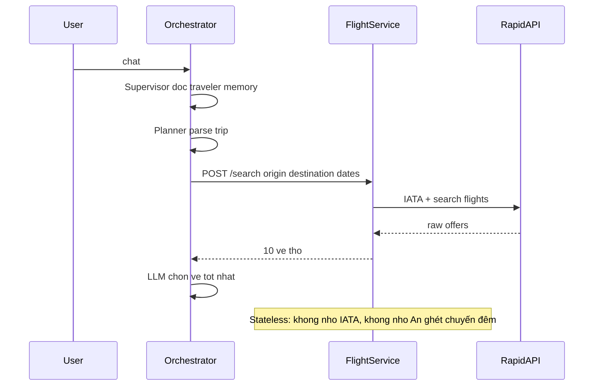
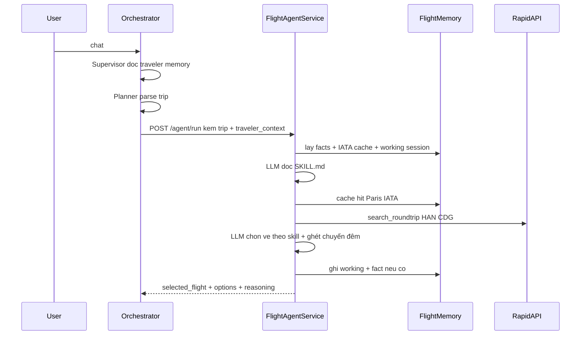

# Bộ nhớ, skill và tool riêng cho từng agent-service

## Mục tiêu bằng một câu

Hôm nay **não** (LLM chọn vé/khách sạn) nằm ở orchestrator, còn 5 service chỉ là **tay** (gọi Booking.com / Ticketmaster / Tavily / OSM).

Sau này mỗi service **tự nghĩ + tự làm + tự nhớ** việc của mình. Orchestrator chỉ nói: “Tìm vé Hà Nội → Paris, ngân sách 2000€, người này ghét chuyến đêm” — rồi nhận về vé đã chọn.

---

## Ba khái niệm (ví dụ Flight)

Tưởng tượng Flight Agent như một nhân viên phòng vé.

**Skill** = sổ tay nội bộ (file `SKILL.md`), không phải code. Ví dụ:

- Ưu tiên bay thẳng; tránh overnight nếu traveler memory nói vậy
- Có IATA trong cache thì đừng gọi lại RapidAPI autocomplete
- Khi evaluator bảo “rẻ hơn”, chọn lại từ danh sách đã có, đừng search mới
- Chỉ ghi memory những thứ bền: “prefer direct”, không ghi “chuyến 12/6/2026”

**Tool** = việc nhân viên được phép làm (hàm Python bọc API sẵn có):

- `lookup_iata("Paris")` → `["CDG", "ORY"]`
- `search_roundtrip(HAN, CDG, dates, person)` → list vé

LLM trong **chính flight-service** quyết định gọi tool nào, theo thứ tự nào. Orchestrator không còn hardcode “gọi /search rồi LLM chọn”.

**Memory** = sổ tay riêng của phòng vé, không phải hồ sơ khách toàn công ty.

Ví dụ user An:

- Orchestrator nhớ: An ở Hà Nội, budget trung bình, ăn chay (hồ sơ du khách — **đã có**)
- Flight Agent nhớ: An ghét layover, lần trước chọn Vietnam Airlines, IATA Paris = CDG+ORY (domain — **chưa có**)
- Hotel Agent nhớ: An thích boutique, rating tối thiểu 8.0
- Flight **không** nhớ khách sạn; Hotel **không** nhớ IATA

---

## Hôm nay vs sau này (cùng một request)

User: “Lên lịch Hà Nội → Paris 10–17/6, 2 người, 2000€, đừng chọn chuyến đêm.”

### Hôm nay



Vấn đề:

- Prompt “ghét chuyến đêm” chỉ sống ở orchestrator; Flight Service không thấy
- Lần sau Paris, vẫn gọi lại IATA API
- Logic chọn vé nằm trong [server/nodes.py](server/nodes.py) (`flight_agent` vừa HTTP vừa LLM)

### Sau này



Orchestrator **không** chọn vé nữa. Node `flight_agent` trong `nodes.py` chỉ đóng gói request và ghi kết quả vào `TripState`.

---

## Ai giữ memory nào (rất quan trọng)

Hai lớp, **không gộp một bảng**.

**A. Traveler memory — giữ nguyên ở orchestrator** ([server/memory/](server/memory/manager.py))

- Working: chat, slots (origin, dates)
- Semantic: home city, budget, dietary, hotel_style
- Episodic: “tháng trước An đi Tokyo”

Dùng cho Supervisor / Planner / câu “lần trước tôi đi đâu?”. **Không** chuyển vào Flight DB.

**B. Domain memory — mới, trong từng agent-service**

Cùng một Postgres `travel_agent`, bảng mới, luôn có cột `agent_id` (`flight`, `hotel`, `event`, `activity`, `geocoding`):

- `agent_facts` — preference domain + embedding. Ví dụ flight: “prefers direct flights”. Retrieve cosine, limit 5, theo `user_id + agent_id`
- `agent_working` — JSON scratch theo session: list vé vừa search, vé đang chọn. Phục vụ refine: evaluator bảo đổi vé → dùng list cũ, không gọi Booking lại
- `agent_cache` — tra cứu **không gắn user**: `paris` → IATA, `Colosseum, Rome` → lat/lon. Lần nào, user nào cũng tái sử dụng

Ví dụ ghi / không ghi:

- Có: “An prefers direct flights”
- Không: “chuyến TK1857 ngày 10/6” (đó là working, hết session thì không thành fact)
- Cache: `"paris" → ["CDG","ORY"]` — không phải preference của An

---

## Skill trông như thế nào

File thật, ví dụ [server/services/flight-service/skills/SKILL.md](server/services/flight-service/skills/SKILL.md):

```markdown
---
name: flight-specialist
description: Search and pick round-trip flights for one traveler.
---

You are the flight specialist. Use tools; do not invent prices.

1. If IATA for origin/destination is already in cache, skip lookup_iata.
2. If task=refine and existing_options is non-empty, do not call search_roundtrip.
3. Prefer direct; avoid overnight if traveler_context says so.
4. Stay near budget. Explain the pick in reasoning.
5. Write durable facts only (airline/style prefs), never this trip's dates.
```

Runtime đọc file → system prompt. Đổi cách chọn vé = sửa markdown, không bắt buộc sửa Python.

Hotel / Event / Activity / Geocoding mỗi nơi một `SKILL.md` riêng (tiêu chí khác nhau).

---

## Tool loop bên trong một service (tối đa ~4 bước)

Không phải “một HTTP = một API”. LLM có thể:

1. `lookup_iata("Hanoi")`
2. `lookup_iata("Paris")` — cache hit, không ra RapidAPI
3. `search_roundtrip(...)`
4. Trả structured result: `{options, selected, reasoning}`

Nếu cache IATA đủ, bỏ bước 1–2. Nếu `task=refine`, bỏ bước 3.

Code RapidAPI hiện tại **giữ nguyên**, chỉ bọc thành tool. Orchestrator không gọi `/search` nữa; `/search` còn để debug / rollback.

---

## Việc của orchestrator sau thay đổi

LangGraph trong [server/agent.py](server/agent.py) **không đổi thứ tự**:

Planner → (Flight ∥ Hotel ∥ Event) → Aggregator → Activity → Geocoding → Scheduler → Evaluator → Map → Report

Đổi **bên trong 5 node** [server/nodes.py](server/nodes.py):

Hôm nay `flight_agent`: HTTP `/search` + LLM `FlightSelection`.

Sau này:

1. Lấy `trip_plan`, `user_id`, `memory_context`, `user_feedback` từ `TripState`
2. `POST http://flight-service:8000/agent/run`
3. Gán `selected_flight` / `flight_options` như cũ

Supervisor vẫn là cửa chat + traveler memory. Nó **không** đọc `agent_facts` của Flight. Chỉ gửi một đoạn text `traveler_context` (“home Hà Nội, ghét chuyến đêm”) để Flight Agent tự dùng.

**Không** tách Planner / Evaluator / Scheduler thành service trong phase này.

---

## Contract HTTP chung

Mọi agent-service:

- `POST /agent/run` — não
- `GET /agent/skills` — xem skill đã load (debug)
- Endpoint cũ giữ, không còn là đường chính

Request (ý tưởng):

- `user_id`, `session_id`
- `task`: `search` hoặc `refine`
- `trip`: origin, destination, dates, person, budget, interests
- `traveler_context`: text từ orchestrator
- `feedback`: “over budget, pick cheaper flight”
- `existing_options`: list vé/khách sạn khi refine

Response:

- `options`, `selected`, `reasoning`
- `memory_hits`: ví dụ `["iata:paris", "fact:prefer direct"]` (debug)

---

## Runtime chung — vì sao cần package

5 service sẽ làm cùng một kiểu: load skill, đọc memory, tool loop, ghi memory. Không copy 5 lần.

Tạo [server/packages/agent_runtime/](server/packages/agent_runtime/):

- Pydantic request/response
- Đọc `skills/*.md`
- CRUD `agent_facts` / `agent_working` / `agent_cache`
- Embed (cùng Gemini embedding như [server/memory/embed.py](server/memory/embed.py))
- Vòng `bind_tools` Groq

Mỗi Dockerfile service copy package này + code service. Docker build context đổi từ `./server/services/flight-service` sang `./server` (hiện context hẹp, image **không** thấy code orchestrator/package).

Service nhận `DATABASE_URL` (cùng Postgres), `GROQ_API_KEY`, `GEMINI_API_KEY`. OpenShift đang 128Mi/service — quá nhỏ khi có LLM; tăng limit.

---

## Từng service sẽ “thông minh” ra sao

**Flight** — mẫu làm trước (phức tạp nhất: IATA + search + chọn).

- Tools: `lookup_iata`, `search_roundtrip`
- Memory: IATA cache, “prefer direct”, working list vé
- Nhận `traveler_context` để tránh chuyến đêm

**Hotel** — giống Flight: `lookup_location_id`, `search_hotels`; nhớ style/rating; refine không search lại.

**Event** — `search_events` (Ticketmaster); LLM lọc theo interests **trong service** (logic đang ở orchestrator).

**Activity** — `search_places` / `place_details` (Tavily); extract địa điểm vật lý trong service (đang ở `activity_extraction_agent`).

**Geocoding** — khác: **cache-first**. Query đã có tọa độ → trả ngay, không LLM, không Nominatim (rate limit 2s). Miss mới geocode; LLM chỉ khi query mơ hồ. Memory chủ yếu là `agent_cache`.

---

## Thứ tự làm (để dễ review)

1. Package `agent_runtime` + 3 bảng DB
2. Docker/env: service nối Postgres + LLM keys
3. **Chỉ Flight** end-to-end: skill, tools, `/agent/run`, `nodes.py` gọi nó — test một trip
4. Lặp pattern: Hotel → Event → Activity → Geocoding
5. Nếu `/agent/run` lỗi: fallback `/search` cũ một thời gian

Không đụng Planner/Evaluator/Map/Report. Không UI quản lý memory. Không Postgres riêng từng service.

---

## Cách biết là xong

Một user nói “đừng chọn chuyến đêm”, plan trip Paris:

- Flight-service log: load skill, memory hit IATA nếu search Paris lần 2, LLM chọn vé không overnight
- Bảng `agent_facts` có hàng `agent_id=flight` cho user đó
- Orchestrator `flight_agent` không còn `bind_tools(FlightSelection)`
- Hotel-service **không** có fact về chuyến bay

Đó là định nghĩa “mỗi agent-service có memory, skill, tools riêng”.
